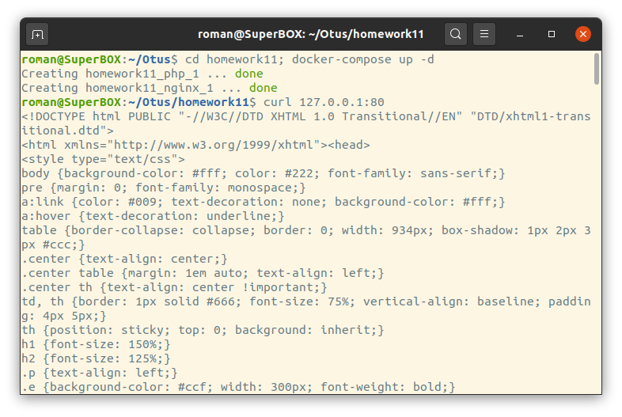
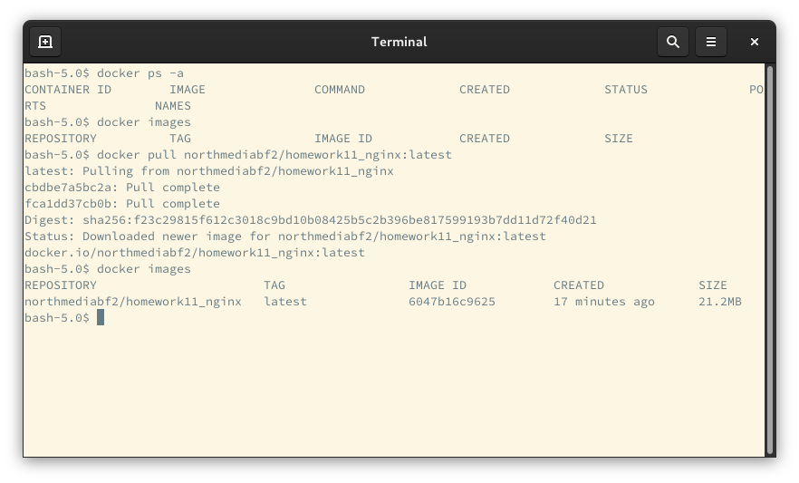

  Домашнее задание 11
  Docker, docker-compose, dockerfile
  Цель: Разобраться с основами docker, с образа, эко системой docker в целом.
  Описание ДЗ в документе: Docker_HW__1-5522-fb6acf.pdf

 - Задание со * (звездочкой)
 - Создайте кастомные образы nginx и php, объедините их в docker-compose.
 - После запуска nginx должен показывать php info.
 - Все собранные образы должны быть в docker hub

# Результат:
 - Запуск лабораторной работы: 
 -  Используем оркестратор docker-compose 
 -  cd homework11; docker-compose up -d
 -  проверяем php info и web : curl 127.0.0.1:80 # 
  
Screenshot:
* docker-compose

*  docker hub
   docker pull northmediabf2/homework11_php:latest
   docker pull northmediabf2/homework11_nginx:latest
